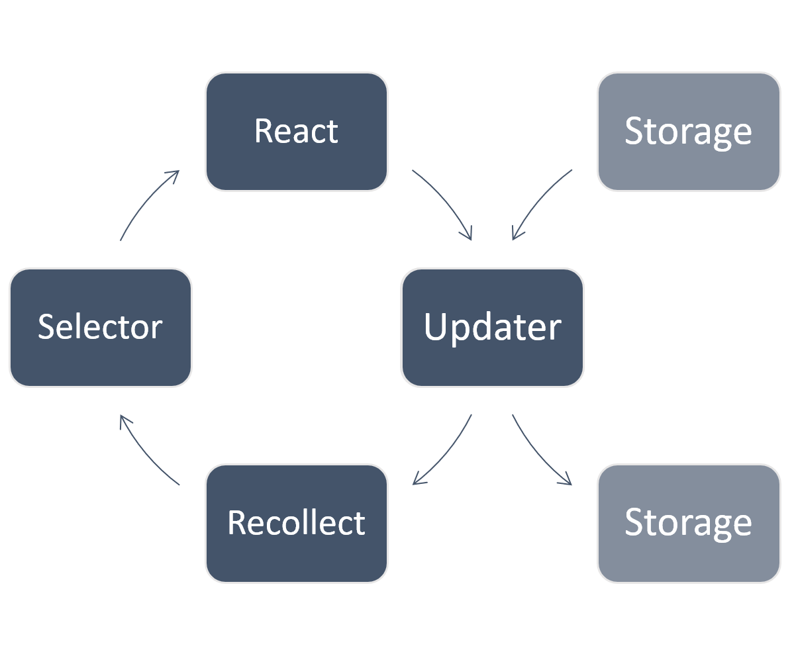

# React Recollect

## What?

Recollect is a state management library for React, an alternative to Redux.

## Why?

Recollect aims to solve two problems with the traditional React/Redux approach:

1. Immutability logic is verbose, complicated, and prone to bugs.
2. Developers must write code to define which parts of the store a component
   plans to use. Even then, components can be re-rendered when they don't use
   the data that has just changed.

## How?

1. The Recollect store is immutable, but the implementation is hidden. So, you
   can interact with the store as though it were a plain JavaScript object.
2. Recollect records access to the store during the render cycle of a component.
   When a property in your store changes, only components that use that property
   are re-rendered.

The result is simpler code and a faster app. Take it for a spin in this
[CodeSandbox](https://codesandbox.io/s/github/davidgilbertson/react-recollect/tree/master/demo).

---

**Caution:** there is no support for any version of IE, Opera mini, or Android
browser 4.4 (because Recollect uses the `Proxy` object). Check out the latest
usage stats for proxies at [caniuse.com](https://caniuse.com/#feat=proxy).

# Quick start

```
npm i react-recollect
```

The `store` object and the `collect` function are all you need to know to get
started.

The store is where your data goes; you can treat it just like you'd treat any
JavaScript object. You can import, read from, and write to the store in any
file.

Here's some code doing normal things with the normal-looking `store`:

```js
import { store } from 'react-recollect';

store.tasks = ['one', 'two', 'three']; // Fine

store.tasks.push('four'); // Good

store.site = { title: 'Page one' }; // Acceptable

Object.assign(store.site, { title: 'Page two' }); // Neato

store.site.title += '!'; // Exciting!

delete store.site; // Seems extreme, but works a treat

store = 'foo'; // Nope! (can't reassign a constant)
```

> Play with this code in a
> [CodeSandbox](https://codesandbox.io/s/normal-store-doing-normal-things-5wz77)

These operations behave just like you'd expect them to, except none of them
_mutate_ the store contents. In fact, it's impossible to mutate the data in a
Recollect store.

Next up: the `collect` function. This wraps a React component, allowing
Recollect to take care of it. This will provide the store as a prop, and update
the component when it needs updating.

Here's `collect` and `store` working together:

```jsx harmony
import { collect } from 'react-recollect';

const TaskList = ({ store }) => (
  <div>
    {store.tasks.map((task) => (
      <div>{task.name}</div>
    ))}

    <button
      onClick={() => {
        store.tasks.push({
          name: 'A new task',
          done: false,
        });
      }}
    >
      Add a task
    </button>
  </div>
);

export default collect(TaskList);
```

Congratulations my friend, you've finished learning Recollect. I am very proud
of you.

Go have a play, and when you're ready for more readme, come back to read on.

If you've got a question, make sure to read the [FAQ](#faq) to see if your Q is
FA. Otherwise, open a GitHub issue.

---

<!-- START doctoc generated TOC please keep comment here to allow auto update -->
<!-- DON'T EDIT THIS SECTION, INSTEAD RE-RUN doctoc TO UPDATE -->

- [Installation](#installation)
  - [NPM](#npm)
  - [CDN](#cdn)
- [API](#api)
  - [`store`](#store)
  - [`collect(ReactComponent)`](#collectreactcomponent)
  - [`afterChange(callback)`](#afterchangecallback)
  - [`initStore(data)`](#initstoredata)
    - [On the server](#on-the-server)
    - [In the browser](#in-the-browser)
  - [`batch(callback)`](#batchcallback)
  - [`useProps(propArray)`](#usepropsproparray)
  - [`PropTypes`](#proptypes)
  - [`window.__RR__`](#window__rr__)
    - [Time travel](#time-travel)
- [Usage with TypeScript](#usage-with-typescript)
  - [Your store](#your-store)
  - [Using collect](#using-collect)
- [Project structure guidelines](#project-structure-guidelines)
  - [Selectors](#selectors)
  - [Updaters](#updaters)
    - [Loading data with an updater](#loading-data-with-an-updater)
    - [Asynchronous updaters](#asynchronous-updaters)
    - [Testing an updater](#testing-an-updater)
- [FAQ](#faq)
  - [How does it work?](#how-does-it-work)
  - [What sort of stuff can go in the store?](#what-sort-of-stuff-can-go-in-the-store)
    - [Map and Set limitations](#map-and-set-limitations)
  - [When will my components be re-rendered?](#when-will-my-components-be-re-rendered)
  - [How many components should I wrap in `collect`?](#how-many-components-should-i-wrap-in-collect)
  - [Can I use this with class-based components and functional components?](#can-i-use-this-with-class-based-components-and-functional-components)
  - [Hooks?](#hooks)
  - [Will component state still work?](#will-component-state-still-work)
  - [Do lifecycle methods still fire?](#do-lifecycle-methods-still-fire)
    - [Why isn't my `componentDidUpdate` code firing?](#why-isnt-my-componentdidupdate-code-firing)
  - [Can I use this with `shouldComponentUpdate()`?](#can-i-use-this-with-shouldcomponentupdate)
  - [Can I wrap a `PureComponent` or `React.memo` in `collect`?](#can-i-wrap-a-purecomponent-or-reactmemo-in-collect)
  - [Can I use this with `Context`?](#can-i-use-this-with-context)
  - [Can I use this with `ref`s?](#can-i-use-this-with-refs)
  - [Can I have multiple stores?](#can-i-have-multiple-stores)
  - [Can I use Recollect without React?](#can-i-use-recollect-without-react)
  - [I'm getting a `no-param-reassign` ESLint error](#im-getting-a-no-param-reassign-eslint-error)
  - [Tell me about your tests](#tell-me-about-your-tests)
  - [How big is it?](#how-big-is-it)
  - [Is reading/writing via a proxy slow?](#is-readingwriting-via-a-proxy-slow)
- [Dependencies](#dependencies)
- [Alternatives](#alternatives)
- [Is it really OK to drop support for IE?](#is-it-really-ok-to-drop-support-for-ie)

<!-- END doctoc generated TOC please keep comment here to allow auto update -->

# Installation

## NPM

Install with npm:

```
npm install react-recollect
```

Or Yarn:

```
yarn add react-recollect
```

You can then import it in the usual ways:

```js
import { collect, store } from 'react-recollect';

// or
const { collect, store } = require('react-recollect');
```

## CDN

You can also load Recollect from the [unpkg CDN](https://unpkg.com).

```html
<script src="https://unpkg.com/react-recollect"></script>
```

This will create a global `ReactRecollect` object. See
[demo/public/browser.html](./demo/public/browser.html) for a working example
with React and Babel.

It's a good idea to reference an exact version in the URL, so that it can be
cached. [Click here](https://unpkg.com/react-recollect) to get the full URL.

# API

## `store`

The `store` object that Recollect exposes is designed to behave like a plain old
JavaScript object. But it's a bit different because it's immutable. You can
write code as though you _were_ mutating it, but internally it will clone the
parts of itself that it needs to clone to apply your changes, without mutating
anything.

When the store is then passed to a component, React can do its clever shallow
comparisons to know whether something has changed and update efficiently.

## `collect(ReactComponent)`

When you wrap a component in `collect`, Recollect will:

- Provide the store object as a prop.
- Collect information about the data the component needs to render (which
  properties in the store it read while rendering).
- Re-render the component when that data changes.

Internally, Recollect 'subscribes' components to property 'paths'. For example,
this component would be subscribed to the `store.page.title` path and
re-rendered when that property changes.

```jsx harmony
import { collect } from 'react-recollect';

const Header = ({ store }) => (
  <header>
    <h1>{store.page.title}</h1>
  </header>
);

export default collect(Header);
```

## `afterChange(callback)`

`afterChange` will call the provided callback whenever the store updates.

The callback receives an event object with these properties:

- `store` — the store
- `changedProps` — the 'paths' of the properties that changed. E.g.
  `['tasks.2.done', 'tasks.4.done']`
- `renderedComponents` — an array of the components that were updated

For example, if you want to save the current page to local storage when a
particular value in the store changes, you could do the following (anywhere in
your app).

```js
import { afterChange } from 'react-recollect';

afterChange((e) => {
  if (e.changedProps.includes('currentPage')) {
    localStorage.currentPage = e.store.currentPage;
  }
});
```

## `initStore(data)`

The `initStore` function will _replace_ the contents of the store with the
object you pass in.

`data` is optional — if you don't pass anything, the store will be emptied
(useful in tests).

If you're only using Recollect in the browser, you don't _need_ to use this, but
it's handy to set the default state of your store. You can also use
`Object.assign(store, { foo: 'bar' })` if you want to shallow-merge new data
into the store.

When you render on the server though, you _do_ need to initialize the store,
because unlike a browser, a server is shared between many users and state needs
to be fresh for each request.

### On the server

Here's a minimal implementation of server-side rendering with Express and
Recollect.

```jsx harmony
// Create an express app instance
const app = express();

// Read the HTML template on start up (this is the create-react-app output)
const htmlTemplate = fs.readFileSync(
  path.resolve(__dirname, '../../build/index.html'),
  'utf8'
);

// We'll serve our page to requests at '/'
app.get('/', async (req, res) => {
  // Fetch some data
  const tasks = await fetchTasksForUser(req.query.userId);

  // Populate the Recollect store (discarding any previous state)
  initStore({ tasks });

  // Render the app. Components will read from the Recollect store as usual
  const appMarkup = ReactDOMServer.renderToString(<App />);

  // Serialize the store (replacing left tags for security)
  const safeStoreString = JSON.stringify(store).replace(/</g, '\\u003c');

  // Insert the markup and the data into the template
  const htmlWithBody = htmlTemplate.replace(
    '<div id="root"></div>',
    `<div id="root">${appMarkup}</div>
    <script>window.__PRELOADED_STATE__ = ${safeStoreString};</script>`
  );

  // Return the rendered page to the user
  res.send(htmlWithBody);
});
```

It's important that you populate the store using `initStore`, and do so before
rendering your app with `ReactDOMServer.renderToString()`.

This is because your Node server might receive several requests from several
users at the same time. All of these requests share the same global state,
including the `store` object.

So, you must make sure that for each request, you empty the store, populate it
with the appropriate data for the request, and render the markup at the same
time. And by 'at the same time', I mean _synchronously_.

### In the browser

In the entry point to your app, right before you call `ReactDOM.hydrate()`, call
`initStore()` with the data that you sent from the server:

```jsx harmony
import { initStore } from 'react-recollect';

// other stuff

initStore(window.__PRELOADED_STATE__);

ReactDOM.hydrate(<App />, document.getElementById('root'));
```

This will take the data that you saved in the DOM on the server and fill up the
Recollect store with it. You should only init the store once, before the initial
render.

Note that `initStore` will trigger a render of collected components where
applicable, and will fire `afterChange`.

## `batch(callback)`

The `batch` function allows you to update the store multiple times, and be
guaranteed that components will only be updated after all updates are made.

The callback function will be called immediately and should only contain
synchronous code.

```js
import { batch } from 'react-recollect';

const fetchData = async () => {
  const { posts, users, meta } = await fetch('/api').then((response) =>
    response.json()
  );

  batch(() => {
    store.posts = posts;
    store.users = users;
    store.meta = meta;
  });

  // now a render will be triggered for any components that use this data
};
```

Note that React already does a good job of batching multiple updates into a
single render cycle. So only clutter up your code with `batch` if it results in
an actual performance improvement.

## `useProps(propArray)`

In most cases, you can rely on Recollect to know what data your component
requires to render. However, Recollect can't know that your component will
require a property in the _future_. If you reference a property:

- in `componentDidUpdate` (and nowhere else), or
- in UI that is only revealed after a change in state (perhaps a modal or
  drop-down)

... then Recollect won't know about it and your component won't be subscribed to
changes in that property.

You can tell Recollect _“I want to know if any of these properties change”_ by
passing an array of store objects to the `useProps` function, like so:

```js
import { collect, useProps } from 'react-recollect';

const MyComponent = ({ store }) => {
  const [showHiddenMessage, setShowHiddenMessage] = useState(false);

  // "This component might read `store.hiddenMessage` in the future"
  useProps([store.hiddenMessage]);

  return (
    <div>
      {showHiddenMessage && <p>{store.hiddenMessage}</p>}

      <button onClick={() => setShowHiddenMessage(true)}>
        Show hidden message
      </button>
    </div>
  );
};

export default collect(MyComponent);
```

Although `useProps` starts with the word 'use', it doesn't require React's Hooks
mechanism, so it works just fine in versions before React 16.8. (For the
curious, the implementation is literally just `propArray.includes(0)`.)

Check out [these tests](tests/unit/useProps.test.tsx) for more usage examples.

## `PropTypes`

As you've learnt by now, Recollect works by 'recording' which properties your
component reads from the store while it renders. This poses a problem if you use
the `prop-types` library, because it is going to read _every property_ that you
define in your prop types.

This could result in your component being subscribed to changes in a property it
doesn't use, potentially concealing a problem that would only become apparent in
production (where prop types aren't checked).

For this reason, `react-recollect` exports a proxied version of `prop-types`.
It's exactly the same as the normal `prop-types` library, except that Recollect
will pause its recording while your props are being checked.

```jsx harmony
import { PropTypes } from 'react-recollect';

const MyComponent = (props) => <h1>{props.title}</h1>;

MyComponent.propTypes = {
  title: PropTypes.string.isRequired,
};

export default MyComponent;
```

We recommended that you uninstall `prop-types` from your project and replace its
usages with the Recollect version. That way no one can accidentally use the
'wrong' `prop-types` (if they didn't get this far in the readme).

If you use `@types/prop-types` you can uninstall that too, the types are built
into `react-recollect`.

## `window.__RR__`

Use `window.__RR__` to inspect or edit the Recollect store in your browser's
console.

`__RR__` does not form part of the official API and should not be used in
production. It might change between versions without warning and without
respecting semver.

It has these properties, available in development or production:

- `debugOn()` will turn on debugging. This shows you what's updating in the
  store and which components are being updated as a result, and what data those
  components are reading. Note that this can have a negative impact on
  performance if you're reading thousands of properties in a render cycle. Note
  also that it will 'collapse' all other console logs into the output (important
  for debugging, but not ideal a lot of the time).
- `debugOff()` will surprise you
- `internals` exposes some interesting things.

Via the `internals` object, you can get a reference to the store, which can be
handy for troubleshooting. For example, typing
`__RR__.internals.store.loading = true` in the console would update the store
and re-render the appropriate components.

If you just log the store to the console, you will see a strange object littered
with `[[Handler]]` and `[[Target]]` props. These are the proxies. All you need
to know is that `[[Target]]` is the actual object you put in the store.

During development there are two more methods to help you inspect your app:

- `getListenersByComponent()` will show you which store properties each
  component is subscribed to.
- `getComponentsByListener()` is the inverse: it will show you which components
  are subscribed to which store properties.

You can optionally pass a string or regular expression to filter the results.

```js
// Which components are subscribed to the user's status
__RR__.getComponentsByListener('user.status');

// What is <MyComponent> subscribed to?
__RR__.getListenersByComponent('MyComponent');

// What about the <Task> component where the prop `taskId` is 2?
__RR__.getListenersByComponent('Task2', (props) => props.taskId);
```

Check out [the debug test suite](./tests/unit/debug.test.tsx) for more examples.

### Time travel

> <small>Added in `5.2.3`</small>

You can navigate through the history of changes to the store with the below
functions (in your DevTools console):

- `__RR__.back()` will go back to the state before the last store change.
- `__RR__.forward()` will go forward again.
- `__RR__.goTo(index)` will go to a particular index in the history.
- `__RR__.getHistory()` will log out the entire history.
- `__RR__.clearHistory()` clears the history.
- `__RR__.setHistoryLimit(limit)` limits the number of store instances kept in
  history. Defaults to `50`. Setting to `0` disables time travel. Is stored in
  local storage.

If you update the store with `initStore` or execute multiple updates within the
`batch` function callback, those changes are recorded as a single history event.

Note that these time travel functions are only available during development, not
in the production build.

# Usage with TypeScript

## Your store

Define the shape of your recollect `store` like this:

```ts
declare module 'react-recollect' {
  interface Store {
    someProp?: string[];
    somethingElse?: string;
  }
}
```

Put this in a declarations file such as `src/types/RecollectStore.ts`.

## Using collect

Components wrapped in `collect` must define `store` in `props` — use the
`WithStoreProp` interface for this:

```tsx
import { collect, WithStoreProp } from 'react-recollect';

interface Props extends WithStoreProp {
  someComponentProp: string;
}

const MyComponent = ({ store, someComponentProp }: Props) => (
  // < your awesome JSX here>
);

export default collect(MyComponent);
```

If the only prop your component needs is `store`, you can use `WithStoreProp`
directly.

```tsx
import { WithStoreProp } from 'react-recollect';

const MyComponent = ({ store }: WithStoreProp) => <div>Hello {store.name}</div>;
```

Recollect is written in TypeScript, so you can check out the
[integration tests](./tests/integration) if you're not sure how to implement
something.

(If you've got Mad TypeScript Skillz and would like to contribute, see if you
can work out how to resolve the `@ts-ignore` in
[the collect module](./src/collect.tsx)).

# Project structure guidelines

The ideas described in this section aren't part of the Recollect API, they're
simply a guide.

Two concepts are described in this section (neither of them new):

- **Selectors** contain logic for retrieving and data from the store.

- **Updaters** contain logic for updating the store. Updaters also handle
  reading/writing data from outside the browser (e.g. loading data over the
  network or from disk).



In a simple application, you don't need to explicitly think in terms of updaters
and selectors. For example:

- defining `checked={task.done}` in a checkbox is a tiny little 'selector'
- executing `task.done = true` when a user clicks that checkbox is a tiny little
  'updater'

But as your app grows, it's important to keep your components focused on UI —
you don't want 200 lines of logic in the `onClick` event of a button.

So there will come a point where moving code out of your components into
dedicated files is necessary, and at this point, updaters and selectors will
serve as useful concepts for organization.

In the examples below, I'll use a directory structure like this:

```
/my-app
 └─ src
    ├─ components
    ├─ store
    │  ├─ selectors
    │  └─ updaters
    └─ utils
```

(Fun fact: _selector_ ends in 'or' because 'select' is derived from latin, while
_updater_ ends in 'er' because it was made up in 1941 and 'or' had gone out of
style.)

## Selectors

A simple case for a selector would be to return all incomplete tasks, sorted by
due date.

```js
export const getIncompleteTasksSortedByDueDate = (store) => {
  const tasks = store.tasks.slice();

  return tasks
    .sort((a, b) => a.dueDate - b.dueDate)
    .filter((task) => !task.done);
};
```

You would then use this function by importing it and referencing it in your
component:

```jsx harmony
import { getIncompleteTasksSortedByDueDate } from '../store/selectors/taskSelectors';

const TaskList = ({ store }) => {
  const tasks = getIncompleteTasksSortedByDueDate(store);

  return (
    <div>
      {tasks.map((task) => (
        <Task key={task.id} task={task} />
      ))}
    </div>
  );
};
```

In this example, I'm passing the `store` object into the `selector`. But you
could also do `import { store } from 'react-recollect'` in the selector file.
(In Recollect version 4 and earlier, you _had_ to pass the store through. From
v5 onwards, you can use `props.store` _or_ import the store.)

Maybe we want to conditionally show either all tasks or only incomplete tasks.
Let's create a second selector. And while we're at it, move repeated sorting
code out into its own function:

```js
const getTasksSortedByDate = (tasks) => {
  const sortedTasks = tasks.slice();

  return sortedTasks.sort((a, b) => a.dueDate - b.dueDate);
};

export const getAllTasksSortedByDueDate = (store) =>
  getTasksSortedByDate(store.tasks);

export const getIncompleteTasksSortedByDueDate = (store) =>
  getTasksSortedByDate(store.tasks).filter((task) => !task.done);
```

And here's a more complex component with local state and a dropdown to show
either all tasks or just those that aren't done:

```jsx harmony
class TaskList extends PureComponent {
  state = {
    filter: 'all',
  };

  render() {
    const { store } = this.props;

    const tasks =
      this.state.filter === 'all'
        ? getAllTasksSortedByDueDate(store)
        : getIncompleteTasksSortedByDueDate(store);

    return (
      <div>
        {tasks.map((task) => (
          <Task key={task.id} task={task} />
        ))}

        <select
          value={this.state.filter}
          onChange={(e) => {
            this.setState({ filter: e.target.value });
          }}
        >
          <option value="all">All tasks</option>
          <option value="incomplete">Incomplete tasks</option>
        </select>
      </div>
    );
  }
}
```

Now, when a user changes the dropdown, the component state will update, a
re-render will be triggered, and as a result, a different selector will be used.

## Updaters

An 'updater' is a function that updates the store in some way. As with
selectors, you don't _need_ to use updaters, they're just an organizational
concept to minimize the amount of data logic you have in your component files.

A simple case for an updater would be to mark all tasks as done in a todo app:

```js
import { store } from 'react-recollect';

export const markAllTasksAsDone = () => {
  store.tasks.forEach((task) => {
    task.done = true;
  });
};
```

You would reference this from a component by importing it then calling it in
response to some user action:

```jsx harmony
import { markAllTasksAsDone } from '../store/updaters/taskUpdaters';

const Footer = () => (
  <button onClick={markAllTasksAsDone}>Mark all as done</button>
);

export default Footer;
```

You don't need to 'dispatch' an 'action' from an 'action creator' to a
'reducer'; you're just calling a function that updates the store.

And since these are just plain functions, they're 'composable'. Or in other
words, if you want an updater that calls three other updaters, go for it.

### Loading data with an updater

Let's create an updater that loads some tasks from an api when our app mounts.
It will need to:

1. Set a loading indicator to true
2. Fetch some tasks from a server
3. Save the data to the store
4. Set the loading indicator to false

```js
export const loadTasksFromServer = async () => {
  store.loading = true;

  store.tasks = await fetchJson('/api/get-my-tasks');

  store.loading = false;
};
```

You might call this function like so:

```js
import { loadTasksFromServer } from '../store/updaters/taskUpdaters';

class TaskList extends React.Component {
  componentDidMount() {
    loadTasksFromServer();
  }

  render() {
    // just render stuff
  }
}
```

### Asynchronous updaters

Did you notice that we've already covered the super-complex topic of
asynchronicity? You can update the Recollect store whenever you like, so you
don't need to do anything special to get asynchronous code to work.

### Testing an updater

Let's write a unit test to call our updater and assert that it put the correct
data in the store. The function we're testing is async, so our test will be
async too:

```js
test('loadTasksFromServer should update the store', async () => {
  // Execute the updater
  await loadTasksFromServer();

  // Check that the final state of the store is what we expected
  expect(store).toEqual(
    expect.objectContaining({
      loading: false,
      tasks: [
        {
          id: 1,
          name: 'Fetched task',
          done: false,
        },
      ],
    })
  );
});
```

Pretty easy, right?

We can make it less easy.

Maybe we want to assert that `loading` was set to `true`, then the tasks loaded,
and then `loading` was set to `false` again.

Well, Recollect exports an `afterChange` function designed to call a callback
every time the store changes. If we pass it a Jest mock function, Jest will
conveniently keep a record of each time the store changed.

Also, no one likes half an example, so here's the entire test file:

```js
import { afterChange, store } from 'react-recollect';
import { loadTasksFromServer } from './taskUpdaters';

jest.mock('../../utils/fetchJson', () => async () => [
  {
    id: 1,
    name: 'Fetched task',
    done: false,
  },
]);

test('loadTasksFromServer should update the store', async () => {
  // Create a mock
  const afterChangeHandler = jest.fn();

  // Pass the mock to afterChange. Jest will record calls to this function
  // and therefore record calls to update the store.
  afterChange(afterChangeHandler);

  // Execute our updater
  await loadTasksFromServer();

  // afterChangeHandler will be called with the new version of the store and the path that was changed
  const firstChange = afterChangeHandler.mock.calls[0][0];
  const secondChange = afterChangeHandler.mock.calls[1][0];
  const thirdChange = afterChangeHandler.mock.calls[2][0];

  expect(firstChange.changedProps[0]).toBe('loading');
  expect(firstChange.store.loading).toBe(true);

  expect(secondChange.changedProps[0]).toBe('tasks');
  expect(secondChange.store.tasks.length).toBe(1);

  expect(thirdChange.changedProps[0]).toBe('loading');
  expect(thirdChange.store.loading).toBe(false);

  // Check that the final state of the store is what we expected
  expect(store).toEqual(
    expect.objectContaining({
      loading: false,
      tasks: [
        {
          id: 1,
          name: 'Fetched task',
          done: false,
        },
      ],
    })
  );
});
```

# FAQ

## How does it work?

Every object you add to the Recollect store gets wrapped in a `Proxy`. These
proxies allow Recollect to intercept reads and writes. It's similar to defining
getters and setters, but far more powerful.

If you were to execute the code below, that `site` object would be wrapped in a
proxy.

```js
store.site = {
  title: 'Page one',
};
```

(Items are deeply/recursively wrapped, not just the top level object you add.)

Now, if you execute the code `store.site.title = 'Page two'`, Recollect won't
mutate the `site` object to set the `title` property. Recollect will block the
operation and instead create a clone of the object where `title` is
`'Page two'`. Recollect keeps a reference between the old and the new `site`
objects, so any attempt to read from or write to the 'old version' will be
redirected to the 'new version' of that object.

In addition to intercepting _write_ operations, the proxies also allow Recollect
to know when data is being _read_ from the store. When you wrap a component in
`collect`, you're instructing Recollect to monitor when that component starts
and stops rendering. Any read from the store while a component is rendering
results in that component being 'subscribed' to the property that was read.

Bringing it all together: when some of your code attempts to write to the store,
Recollect will clone as described above, then notify all the components that use
the property that was updated, passing those components the 'next' version of
the store.

## What sort of stuff can go in the store?

You can store anything that's valid JSON. If that's all you want to do, you can
skip the rest of this section.

Recollect will store data of any type, including (but not limited to):

- `undefined`
- `Map`
- `Set`
- `RegExp` objects
- `Date` objects

Recollect will _monitor_ changes to:

- Primitives (string, number, boolean, null, undefined, symbol)
- Plain objects
- Arrays
- Maps (see limitations below)
- Sets (see limitations below)

Recollect will store, but not monitor attempted mutations to other objects. For
example:

- `store.date = new Date()` is fine.
- `store.date.setDate(7)` will not trigger an update.
- `store.uIntArray = new Uint8Array([3, 2, 1])` is fine.
- `store.uIntArray.sort()` will not trigger an update.

The same applies to `WeakMap`, `DataView`, `ArrayBuffer` and any other object
you can think of.

If there's a data type you want to store and mutate that isn't supported, log an
issue and we'll chat.

Other things that aren't supported (or haven't been tested):

- Functions (e.g. getters, setters, or other methods)
- Class instances (if this would be useful to you, log an issue and we'll chat)
- Properties defined with `Object.defineProperty()`
- String properties on arrays, Maps and Sets (I don't mean string _keys_ in
  maps, I mean actually creating a property on the object itself — a fairly
  unusual thing to do)
- `Proxy` objects (if this would be useful to you, log an issue and we'll chat)
- Linking (e.g. one item in the store that is a reference to another item in the
  store)

You can even store components in the store if you feel the need. This hasn't
been performance tested, so proceed with caution.

```jsx harmony
const Page = collect(({ store }) => {
  const { Header, Footer, Button } = store.components;

  return (
    <React.Fragment>
      <Header title="Page one" />

      <Button onClick={doSomething} />

      <Footer />
    </React.Fragment>
  );
});
```

### Map and Set limitations

Updating an object _key_ of a map entry will not always trigger a render of
components using that object. But in most cases you'd be storing your data in
the _value_ of a map entry, and that works fine.

Similarly, updating an object in a set may not trigger an update to components
using that object (adding/removing items from a set works fine).

## When will my components be re-rendered?

Short version: when they need to be, don't worry about it.

Longer version: if a _property_ is changed (e.g.
`store.page.title = 'Page two'`), any component that read that property when it
last rendered will be updated. If an object, array, map or set is changed (e.g.
`store.tasks.pop()`) any component that read that object/array/map/set will be
updated.

Check out [tests/integration/updating](tests/integration/updating.test.tsx) for
the full suite of scenarios.

## How many components should I wrap in `collect`?

You can wrap every component in `collect` if you feel like it. As a general
rule, the more you wrap in `collect`, the fewer unnecessary renders you'll get,
and the less you'll have to pass props down through your component tree.

There is one rule you must follow though: do not pass part of the store _into_ a
collected component as props. Don't worry if you're not sure what that means,
you'll get a development-time error if you try.
[This issue explains why](https://github.com/davidgilbertson/react-recollect/issues/102).

When dealing with components that are rendered as array items (e.g. `<Product>`s
in a `<ProductList>`), you'll probably get the best performance with the
following setup:

- Wrap the parent component in `collect`.
- Don't wrap the child component in `collect`
- Pass the required data to the child components as props.
- Mark the child component as pure with `memo()` or `PureComponent`.

With this arrangement, when an item in the array changes (e.g. a product is
starred), Recollect will immutably update only that item in the store, and
trigger the parent component to update. React will skip the update on all the
children that didn't change, so only the one child will re-render.

For a working example, see the
[Recollect demo on CodeSandbox](https://codesandbox.io/s/lxy1mz200l).

## Can I use this with class-based components and functional components?

Yep and yep.

## Hooks?

Yep.

## Will component state still work?

Yes, but be careful. If a change in state reveals some new UI, and a property
from the store is only read in that UI (not elsewhere in the component) then
Recollect won't be aware of it, and won't update your component if it changes.

Use the [`useProps`](#usepropsproparray) function to make sure your component is
subscribed to changes in this property.

## Do lifecycle methods still fire?

Yep. Recollect has no effect on `componentDidMount`, `componentDidUpdate` and
friends.

### Why isn't my `componentDidUpdate` code firing?

If you have a store prop that you _only_ refer to in `componentDidUpdate` (e.g.
`store.loaded`), then your component won't be subscribed to changes in that
prop. So when `store.loaded` changes, your component might not be updated.

Use the [`useProps`](#usepropsproparray) function to make sure your component is
subscribed to changes in this property.

## Can I use this with `shouldComponentUpdate()`?

Yes, but no, but you probably don't need to.

The
[React docs](https://reactjs.org/docs/react-component.html#shouldcomponentupdate)
say of `shouldComponentUpdate()`:

> This method only exists as a performance optimization. Do not rely on it to
> “prevent” a rendering, as this can lead to bugs ... In the future React may
> treat shouldComponentUpdate() as a hint rather than a strict directive, and
> returning false may still result in a re-rendering of the component

So, if you're using `shouldComponentUpdate` for _performance_ reasons, then you
don't need it anymore. If the `shouldComponentUpdate` method is executing, it's
because Recollect has _told_ React to update the component, which means a value
that it needs to render has changed.

## Can I wrap a `PureComponent` or `React.memo` in `collect`?

There's no need. The `collect` function wraps your component in a
`PureComponent` and there's no benefit to having two of them.

It's a good idea to wrap _other_ components in `PureComponent` or `React.memo`
though — especially components that are rendered in an array, like `<Todo>`. If
you have a hundred todos, and add one to the list, you can skip a render for all
the existing `<Todo>` components if they're marked as pure.

## Can I use this with `Context`?

Yes. Recollect doesn't interfere with other libraries that use `Context`.

You shouldn't need to use `Context` yourself though. You have a global `store`
object that you can read from and write to anywhere.

## Can I use this with `ref`s?

Yes, refs just work, as long as you don't use the reserved name 'ref' (React
strips this out). You can use something like `inputRef` instead. For an example,
see [this test](tests/react/forwardRefFc.test.tsx)

## Can I have multiple stores?

No. There is no performance improvement to be had, so the desire for multiple
stores is just an organizational preference. For this, you can use 'selectors'
to focus on a subset of your store.

## Can I use Recollect without React?

Yes! You can use `store` without using `collect`. Pair this with `afterChange`
to have an object that notifies you when its changed. For an example, check out
[tests/integration/nodeJs.js](./tests/integration/nodeJs.js)

## I'm getting a `no-param-reassign` ESLint error

You can add 'store' as a special case in your ESLint config so that the rule
allows you to mutate the properties of store.

```json
{
  "rules": {
    "no-param-reassign": [
      "error",
      {
        "props": true,
        "ignorePropertyModificationsFor": ["store"]
      }
    ]
  }
}
```

Check out the `no-param-reassign` rule in this repo's
[eslint config](./.eslintrc.json) for the syntax.

## Tell me about your tests

- There's 100+ integration/unit tests in the [tests](./tests) directory.
- There's a `/demo` directory with a Create React App site using Recollect. This
  has a Cypress test suite.
- There's [/demo/public/browser.html](./demo/public/browser.html) for manual
  testing of the UMD build of Recollect.

## How big is it?

3—5 KB, depending on what else you've got installed. If you're coming from Redux
land, you'll save about 1 KB in library size, but the big savings come from
getting rid of all your reducers.

## Is reading/writing via a proxy slow?

Slow, no. Slower than vanilla object operations, yes.

Let's quantify with a case study: in an app that has a store with ~80,000
properties, ~30,000 of them proxied objects and ~1,000 component listeners,
updating a chunk of data requiring 50 new proxies takes ~2 milliseconds (on
desktop). For that app, 2ms was considered insignificant compared to the ~90ms
spent on the resulting render cycle.

If you're processing big data and facing performance troubles, open an issue and
we'll chat.

# Dependencies

Recollect has a peer dependency of React `>=15.3`.

# Alternatives

If you want IE support, use Redux.

If you want explicit 'observables' and multiple stores, use MobX.

If you want a walk down memory lane, use Flux.

Also there is a library that is very similar to this one (I didn't copy,
promise) called
[`react-easy-state`](https://github.com/solkimicreb/react-easy-state).

# Is it really OK to drop support for IE?

Sure, why not! Imagine: all that time you spend getting stuff to work for a few
users in crappy old browsers could instead be spent making awesome new features
for the vast majority of your users.

For inspiration, these brave websites have dropped the hammer and dropped
support for IE:

- GitHub (owned by Microsoft!)
- devdocs.io
- Flickr
- Codepen
