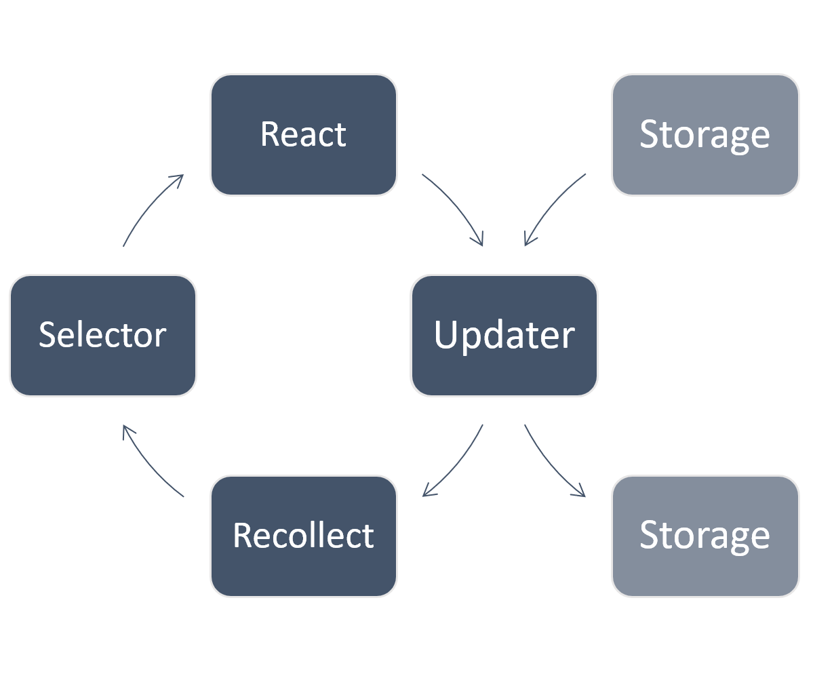

# Project organization

The ideas described on this page aren't part of the Recollect API, they're simply a guide — a suggestion for how you might like to organize your code.

## Concepts

This page talks about the concept of 'updaters' and 'selectors' (neither of them new ideas).

**Selectors** contain logic for retrieving data from the store.

**Updaters** contain logic for updating the store (see [updater-pattern.md](./updater-pattern.md) for more). Updaters also handle reading/writing data from outside the app (e.g. loading data over the network or from disk).



In a simple application, you don't need to explicitly think in terms of updaters and selectors. For example:

- defining `checked={task.done}` in a checkbox is a tiny little 'selector'
- executing `task.done = true` when a user clicks that checkbox is a tiny little 'updater'

But as your app grows, it's important to keep your components focused on UI — you don't want 200 lines of logic in the `onClick` event of a button.

So there will come a point where moving code out of your components into dedicated files is necessary, and at this point, updaters and selectors will serve as useful concepts for organization.

## Directory structure

Here's a simple starting point for a directory structure that should suit many small-to-medium sized apps:

```
/my-app
 └─ src
    ├─ components
    ├─ store
    │  ├─ selectors
    │  └─ updaters
    └─ utils
```

Everything to do with UI is in one directory. Everything to do with data in another. Then inevitably you'll have things like utils and constants and so on.

But if your app has several distinct areas with some shared code, or hundreds of components, you may want to group components/selectors/updaters together for each of these distinct areas.

For example, if your site had 'admin' and 'products' sections, you might break it up like so:

```
/my-app
└─ src
   ├─ admin
   │  ├─ components
   │  ├─ store
   │  │  ├─ selectors
   │  │  └─ updaters
   │  └─ utils
   ├─ common
   │  ├─ components
   │  ├─ store
   │  │  ├─ selectors
   │  │  └─ updaters
   │  └─ utils
   └─ products
      ├─ components
      ├─ store
      │  ├─ selectors
      │  └─ updaters
      └─ utils
```

Ultimately, it's more important to be consistent across your codebase than it is to be consistent with the examples on this page.
